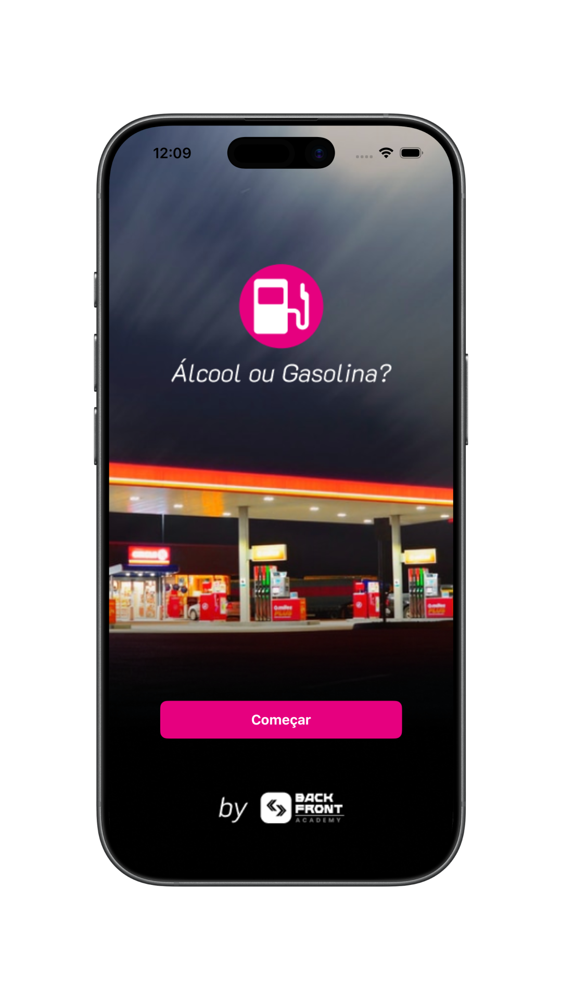
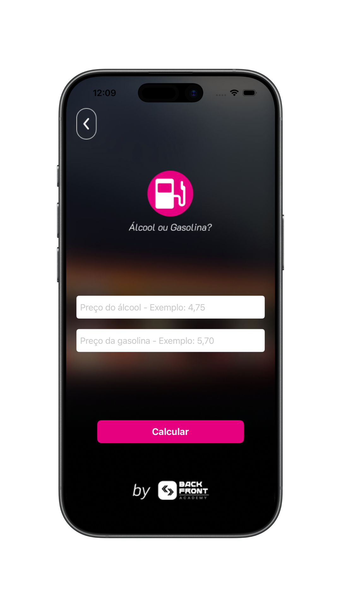
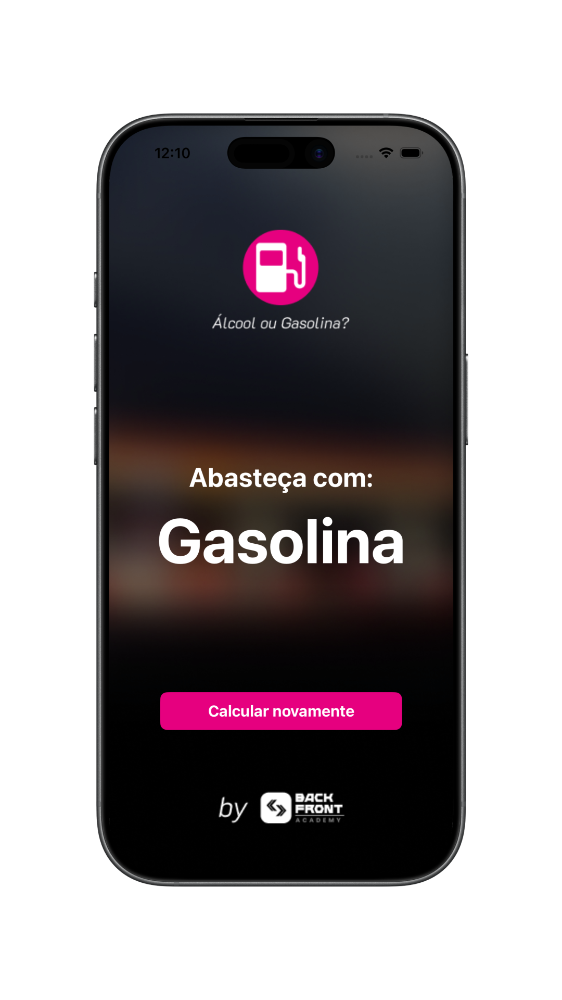
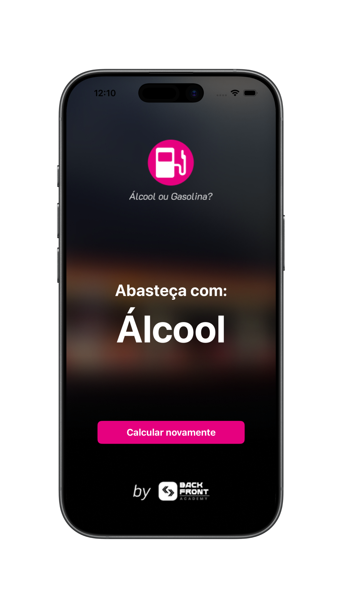

<div align="center">
  

  # FuelPick

  Um aplicativo iOS para comparar os preços do álcool e da gasolina e ajudar na escolha do combustível.

  [](https://www.swift.org/)
  [](https://developer.apple.com/documentation/uikit)
  [](#arquitetura)
</div>

## 📱 Sobre o projeto

O **FuelPick** é um aplicativo iOS que ajuda o usuário a escolher entre álcool e gasolina a partir dos preços informados. Após acessar a calculadora, o usuário preenche o valor por litro de cada combustível e recebe o resultado em uma tela dedicada, com a opção de calcular novamente.

O cálculo divide o preço do álcool pelo preço da gasolina. Quando a relação é **maior que 70%**, o app indica **gasolina**; quando é **menor ou igual a 70%**, indica **álcool**. A comparação utiliza esse limite fixo, sem considerar o consumo específico do veículo.

Desenvolvido em **Swift**, o projeto utiliza **UIKit com View Code** e arquitetura **MVVM** nos fluxos de cálculo e resultado. Os cálculos são realizados localmente, e o **IQKeyboardManagerSwift** auxilia no gerenciamento do teclado durante o preenchimento dos campos.

## 🖼️ Demonstração

<p align="center">
  
  
  
  
</p>

## ✨ Funcionalidades

- Comparação entre os preços por litro do álcool e da gasolina
- Indicação do combustível com base no limite de 70%
- Alerta para campos vazios ou valores que não podem ser convertidos em números
- Tela de resultado com o combustível indicado
- Opção de calcular novamente
- Teclado decimal com botão para concluir a edição
- Fechamento do teclado ao tocar fora dos campos
- Cálculo local, sem necessidade de conexão com a internet

## 🛠️ Tecnologias

| Tecnologia | Uso no projeto |
| --- | --- |
| Swift 5 | Linguagem principal |
| UIKit + View Code | Construção das telas de forma programática |
| Auto Layout | Posicionamento e dimensionamento dos elementos com constraints |
| MVVM | Separação entre interface, controle das telas e lógica de cálculo e apresentação |
| Foundation + NumberFormatter | Conversão dos preços informados em valores numéricos |
| IQKeyboardManagerSwift | Gerenciamento do teclado durante a entrada dos preços |
| Swift Package Manager | Gerenciamento das dependências |

<a id="arquitetura"></a>

## 🏗️ Arquitetura

O código está organizado por funcionalidades. As telas ficam em classes `Screen`, responsáveis pela interface, enquanto as `ViewController` coordenam as interações e a navegação. A `CalculatorViewModel` valida os campos e realiza a comparação dos preços, e a `ResultViewModel` fornece o texto do combustível indicado.

A comunicação entre as telas, os controllers e a lógica de cálculo utiliza protocolos e delegates. A navegação entre os fluxos é feita com `UINavigationController`.

```text
FuelPick/
├── App/             # Ciclo de vida e configuração da navegação inicial
├── Features/        # Telas e lógica organizadas por fluxo
│   ├── Home/        # Tela inicial e acesso à calculadora
│   ├── Calculator/  # Entrada dos preços, validação e cálculo
│   └── Result/      # Apresentação do combustível indicado
├── Resources/       # Imagens, ícone e demais assets
└── Utils/           # Extensões para alertas e interação com o teclado
```

O fluxo de cálculo segue, de forma simplificada:

```text
CalculatorScreen → CalculatorViewController ⇄ CalculatorViewModel
                            ↓
                  ResultViewController ⇄ ResultViewModel
                            ↓
                       ResultScreen
```

## 🚀 Como executar

1. Clone o repositório:

   ```bash
   git clone https://github.com/julianosgarbossa/FuelPick.git
   cd FuelPick
   ```

2. Abra o projeto no Xcode:

   ```bash
   open FuelPick.xcodeproj
   ```

3. Aguarde o Swift Package Manager carregar as dependências.

4. Selecione o scheme **FuelPick** e um simulador de iPhone com **iOS 26.5 ou superior**, conforme o deployment target configurado no projeto. Utilize uma versão do Xcode compatível com esse SDK.

5. Execute com `⌘R`.

> Para executar em um iPhone físico, selecione sua equipe em **Signing & Capabilities** e ajuste o Bundle ID, se necessário.
